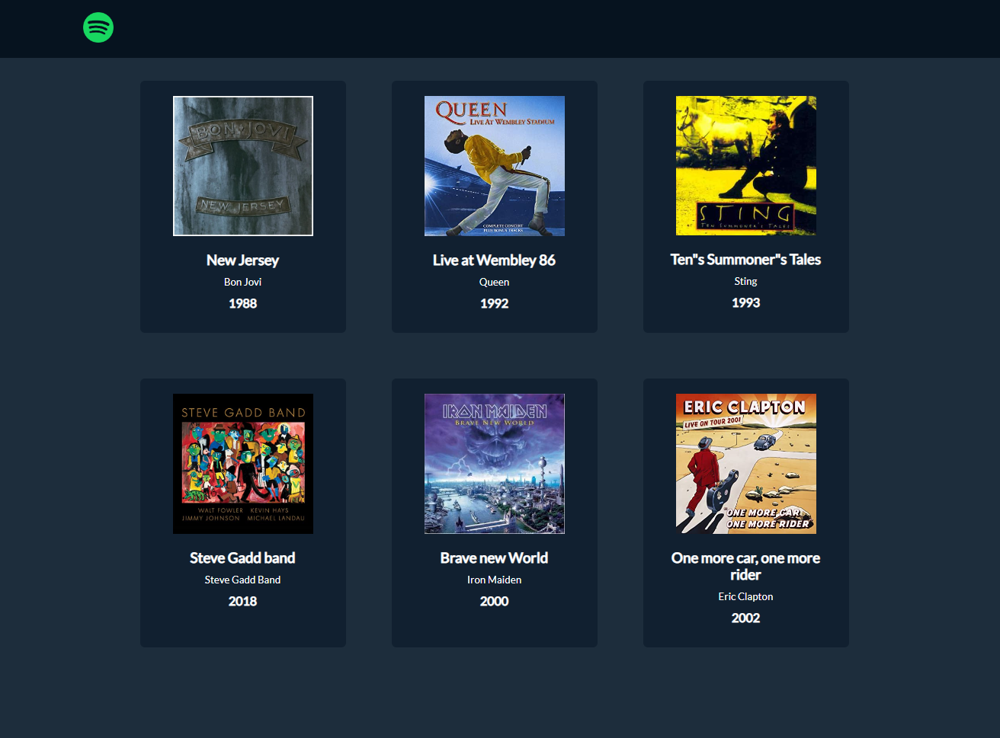
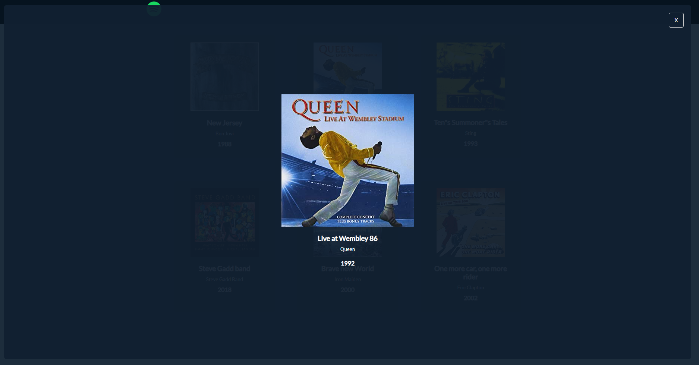

# PHP Dischi JSON

## Descrizione

- Dobbiamo creare una web-app che permetta di leggere una lista di dischi presente nel nostro server.
- Stack
  - Html
  - CSS
  - VueJS (importato tramite CDN)
  - Axios
  - PHP

### Consigli

```txt
Nello svolgere l’esercizio seguite un approccio graduale.
Prima assicuratevi che la vostra pagina index.php (il vostro front-end) riesca a comunicare correttamente con il vostro script PHP (le vostre “API”).
Solo a questo punto sarà utile passare alla lettura della lista da un file JSON.
```

## Bonus

- Al click su un disco, recuperare e mostrare i dati del disco selezionato.

### Vi lascio il mockup per il layout, sentitevi liberi di esprimere la vostra creatività



